# Quản lý học sinh cần xin học bổng

## 1. Mô tả bài toán:

- Ứng dụng giúp quản lý học sinh có nhu cầu xin học bổng từ ứng dụng.
- Trên ứng dụng, người dùng cần login và sau khi login thành công có thể quản lý học sinh xin học bổng.

## 2. Yêu cầu hệ thống:

- Xem danh sách học sinh. Khi click vào 1 dòng thì hiển thị dạng chi tiết: họ tên ,
  giới tính, ngày tháng năm sinh, nơi sinh, điểm tổng kết, hoàn cảnh gia đình.
- Cập nhật thông tin học sinh như ngày nhận học bổng, số tiền học bổng, tổ chức cho học bổng.
- Có thể xem thống kê danh sách học sinh đã nhận học bổng.
- Có thể cấu hình tên tổ chức cho học bổng.

## 3.Sơ đồ:

### 3.1 sơ đồ logic

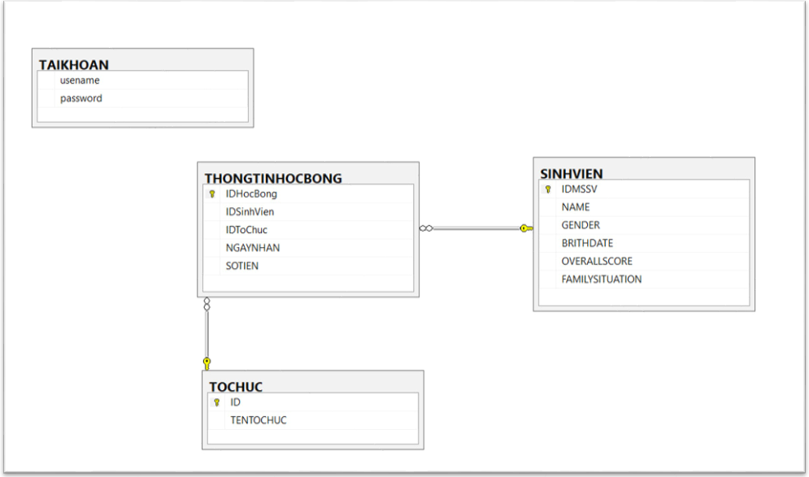

### 3.1 sơ đồ chức năng hệ thống

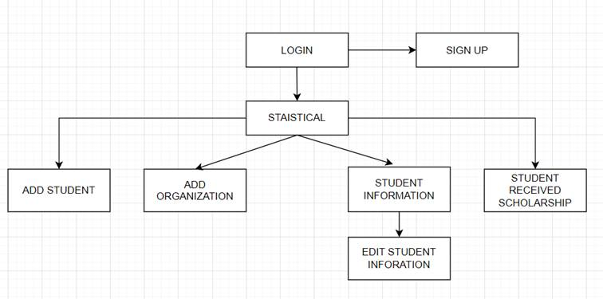

## 4. Thiết kế giao diện:

### 4.1 Màn hình đăng nhập tài khoản

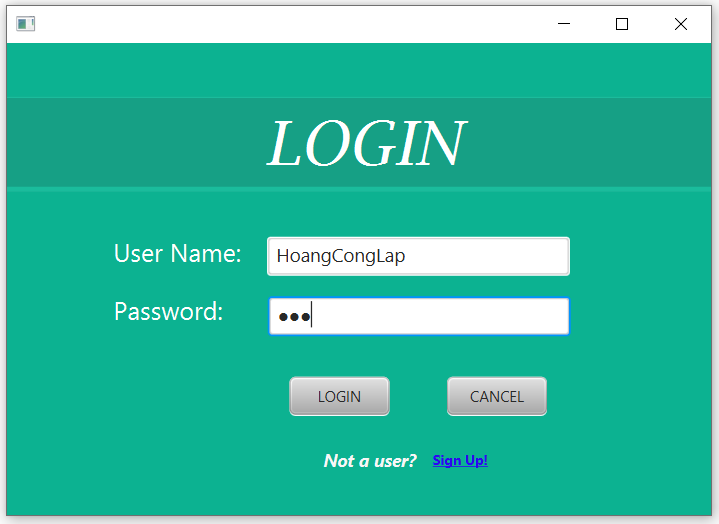

### 4.2 Màn hình đăng Ký tài khoản

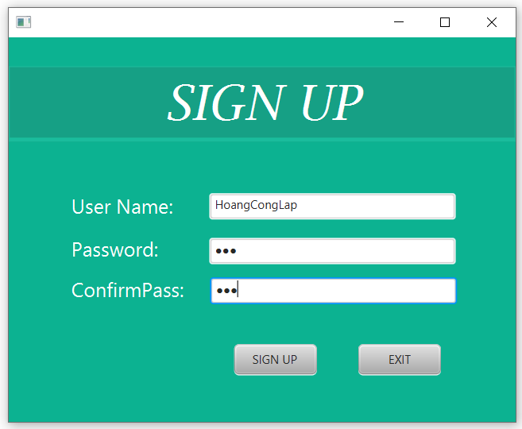

- Nếu để trống thông tin TextField sẽ hiển thị cảnh báo và màu viền (border-color) sẽ hiển thị màu đỏ.
- Nếu Password và ConfirmPass không trùng sẽ xuất hiện cảnh báo và không đăng ký được tài khoản.

### 4.3 Màn hình chức năng

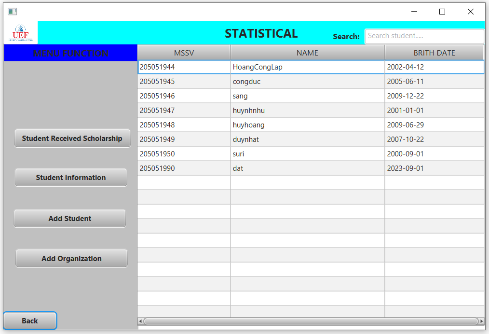

#### 4.3.1 Có thể xem tất cả thông tin học sinh

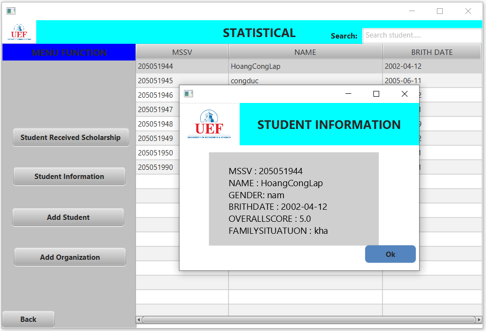

### 4.4 Màn hình thêm học sinh

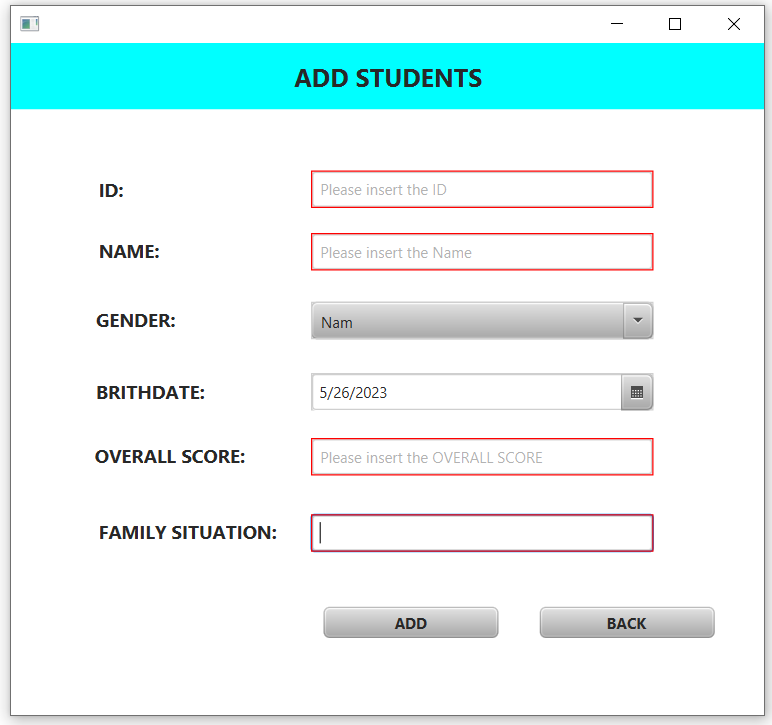

- Cho phép thêm học sinh mới vào database. Yêu cầu nhập đầy đủ thông tin, nếu không sẽ báo lỗi nhập thiếu và yêu cầu bổ sung.

### 4.5 Màn hình thêm tổ chức

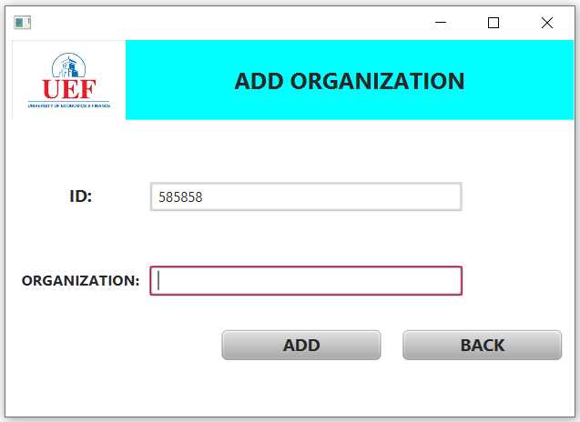

- Cho phép thêm một tổ chức mới vào database. Yêu cầu nhập đầy đủ thông tin, nếu không sẽ báo lỗi nhập thiếu và yêu cầu bổ sung.

### 4.6 Màn hình tất cả thông tin học sinh đã có học bổng

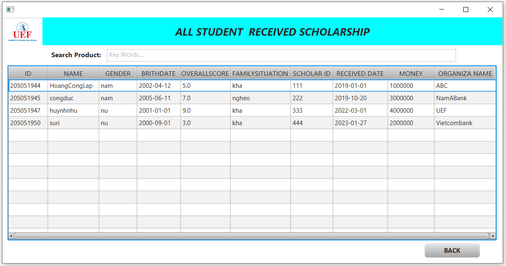

### 4.7 Màn hình tất cả thông tin học sinh

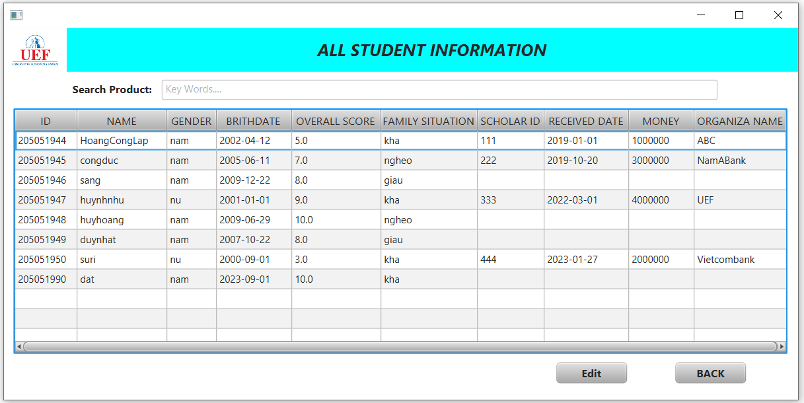

#### 4.7.1 cho phép thêm thông tin học bổng cho học sinh

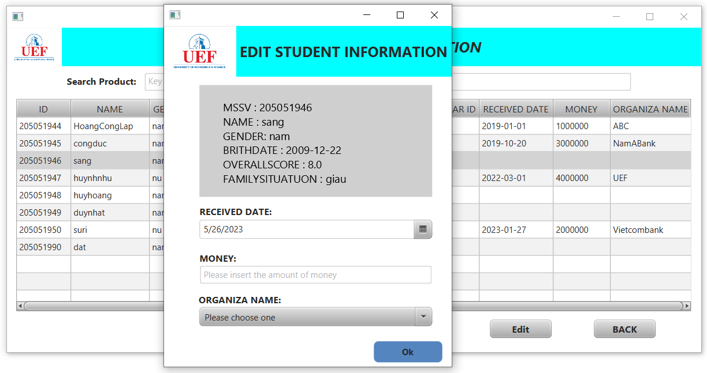

## 5. Môi trường phát triển và Kết quả thực hiện

### 5.1. Môi trường phát triển

- Hệ điều hành: Microsoft Windows 10
- Hệ quản trị cơ sở dữ liệu: Microsoft MySQL
- Công cụ phân tích thiết kế: IntelliJ IDEA 2021
- Công cụ xây dựng ứng dụng: IntelliJ IDEA 2021

### 5.2. Kết quả thực hiện và hướng phát triển

- Chương trình đã được hoàn thiện hầu hết các chức năng
- Cần cải thiện hiệu năng của chương trình để phù hợp với thực tiễn.

## 6. Video

{@youtube: https://www.youtube.com/watch?v=sn8Ni8xTiCA}
